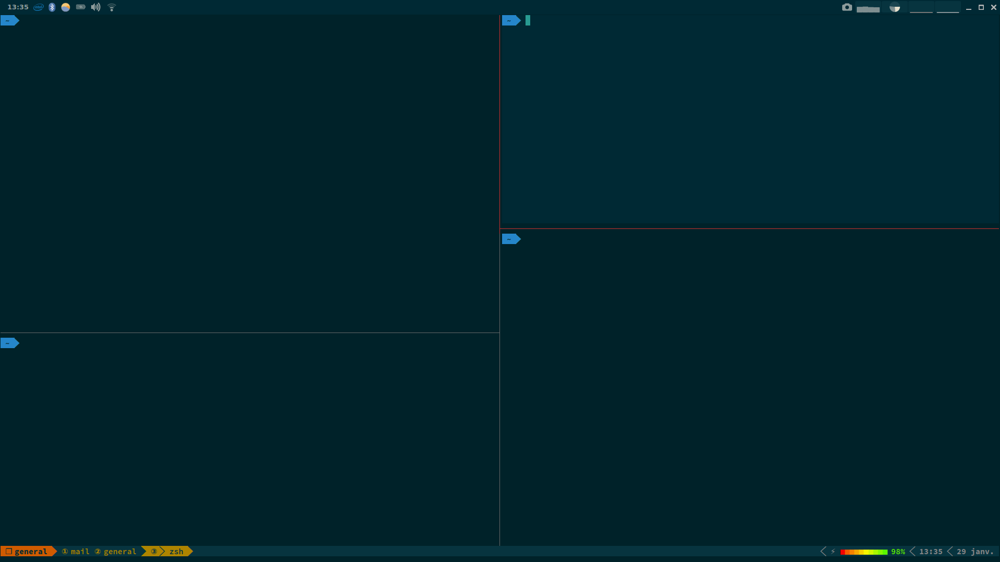

# tmux
tmux config

This is my personnal adaption of the [great config of gpakosz](https://github.com/gpakosz/.tmux). Check his README for configuration instructions.

Warning: some config are hardcoded for my personnal use, and some other depends on specific software config (mutt, vim for example). This tmux config is also tuned for usage with a solarized dark color scheme (http://ethanschoonover.com/solarized).

